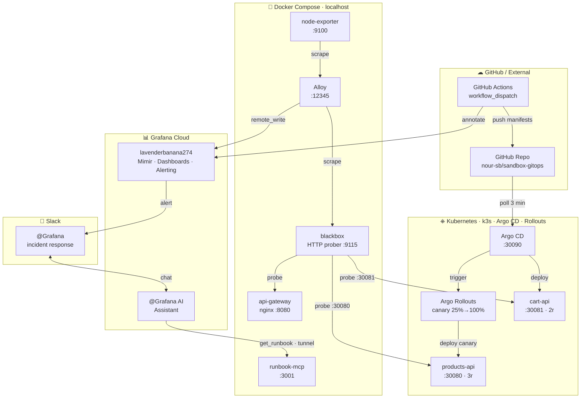

# sandbox-grafana

Local demo stack for testing Grafana Assistant. Full summary in [SUMMARY.md](SUMMARY.md).

## Architecture

> Animated interactive version: [stack-diagram.html](stack-diagram.html) (open locally)

## Stack

Docker Compose: node-exporter, nginx, blackbox-exporter, Grafana Alloy, k3s, Argo CD, Argo Rollouts.  
Metrics remote-write → `lavenderbanana274.grafana.net` (Grafana Cloud free tier, AP Southeast).

## Structure

| Path | Purpose |
|---|---|
| `docker-compose.yml` | Full local stack |
| `config.alloy` | Alloy scrape + remote_write config |
| `alerts/` | Grafana alert rule JSON (provisioning API) |
| `manifests/` | Kubernetes manifests (Argo CD GitOps) |
| `runbooks/` | Alert runbooks |
| `runbook-mcp/` | Local MCP server exposing runbooks to Grafana Assistant |
| `SUMMARY.md` | Full testing journal and findings |
| `MILESTONES.md` | Feature milestone tracker |
